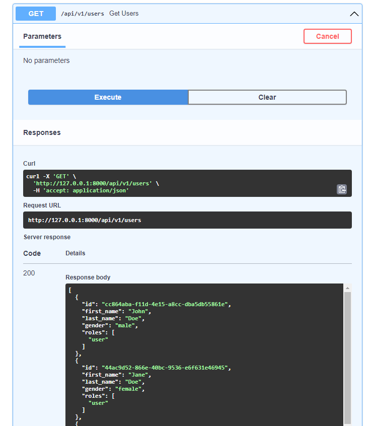
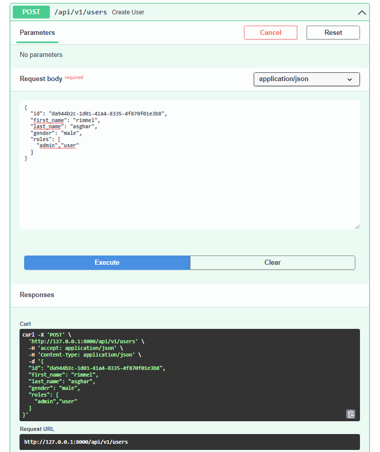
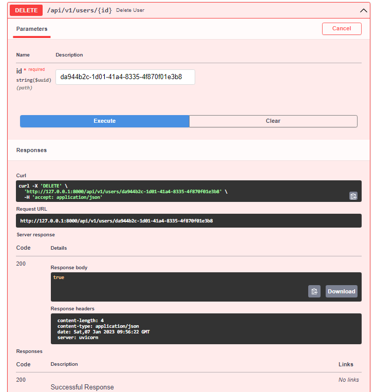
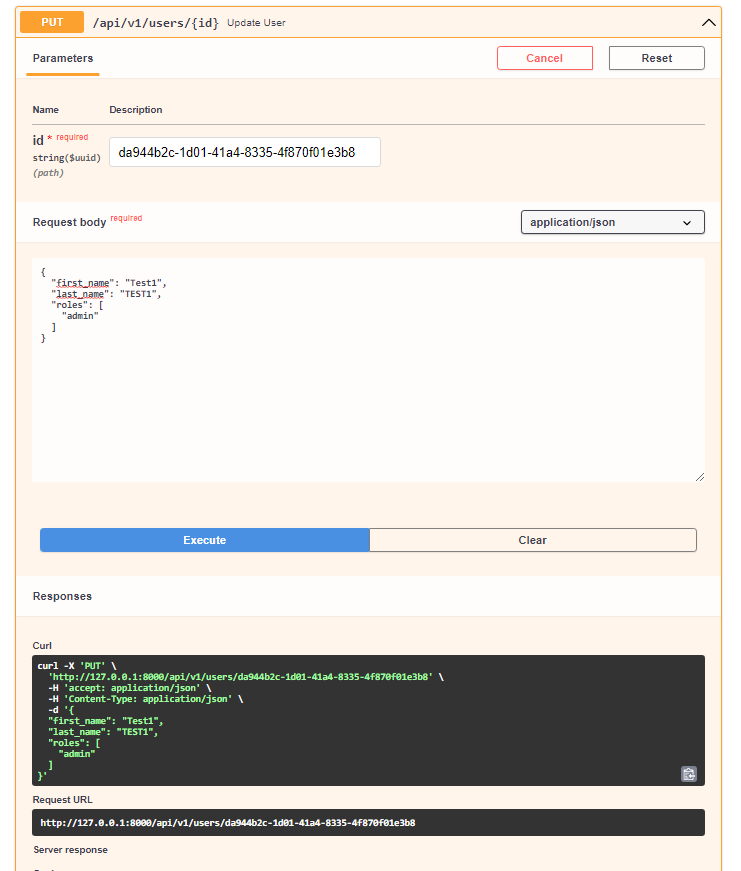

In this tutorial, we will be building a Simple CRUD application with FastAPI. The application will be able to:

- Create a user
- Read a user’s database record
- Update an existing user
- Delete a particular user
 
To execute these CRUD operations, we will create methods that expose the API endpoints. The result will be an in-memory database that can store a list of users.

- You’ll use the [pydantic](https://docs.pydantic.dev/) library to perform data validation and settings management using Python type annotations
- For Database we will be using in-memory database. This is to quickly get you started with using FastAPI to build your APIs. However, for production, you can make use of any database of your choosing, such as PostgreSQL, MySQL, SQLite, or even Oracle.


# ⚙️ Prerequisites

- You need to have python installed. You can install it from microsoft store or follow this [guide](https://www.geeksforgeeks.org/how-to-install-python-on-windows/).

# Setting up a Virtual Enviroment

It’s a common practice to have your Python apps and their instances running in virtual environments. Virtual environments allow different package sets and configurations to run simultaneously, and avoid conflicts due to incompatible package versions. 

Create a Virtual Enviroment in python by executing following command.
```bash
$ python3 -m venv env
```
activate the virtual environment.
```bash
# On Unix or MacOS (bash shell): 
/path/to/venv/bin/activate

# On Unix or MacOS (csh shell):
/path/to/venv/bin/activate.csh

# On Unix or MacOS (fish shell):
/path/to/venv/bin/activate.fish

# On Windows (command prompt):
\path\to\venv\Scripts\activate.bat

# On Windows (PowerShell):
\path\to\venv\Scripts\Activate.ps1
```

# Installation:
now install FastAPI
```bash
 $ pip install fastapi
```
FastAPI is a framework for building APIs, but to test your APIs you’ll need a local web server. Uvicorn is a lightning-fast Asynchronous Server Gateway Interface (ASGI) web server for Python that is great for development. 
To install Uvicorn, run this command:

```bash
$ pip install "uvicorn[standard]"
```

# Working:
Thats it! You are ready to go. </br>
run the Project by executing this.
```bash
$ uvicorn main:app --reload
```

Project will be available on
``http://127.0.0.1:8000``

# FastAPI Interactive API Documentation:
FastAPI uses Swagger UI to provide automatic interactive API documentation. To access it, navigate to http://localhost:8000/docs and you will see a screen with all your endpoints, methods, and schemas.
##### GET Request:

##### POST Request:

##### DELETE Request:

##### UPDATE Request:


# Troubleshooting
If you are facing any problems, feel free to open an issue or contact me on `rimmelasghar4@gmail.com` 


[](https://opensource.org/licenses/MIT)
<br>
<br>
Code by Rimmel with ❤
